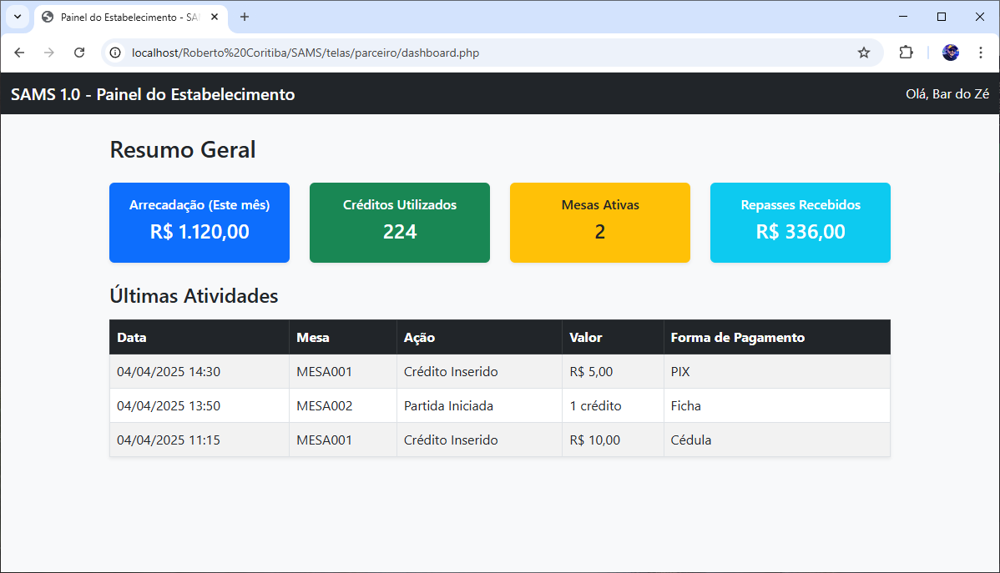
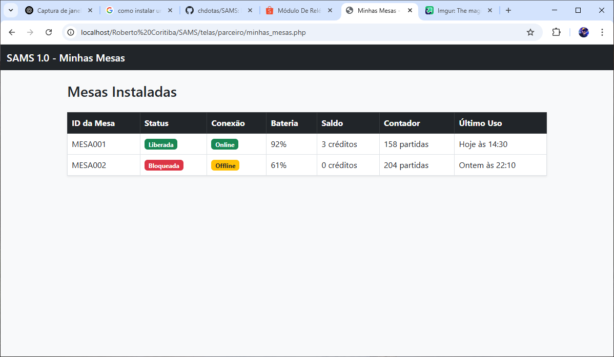
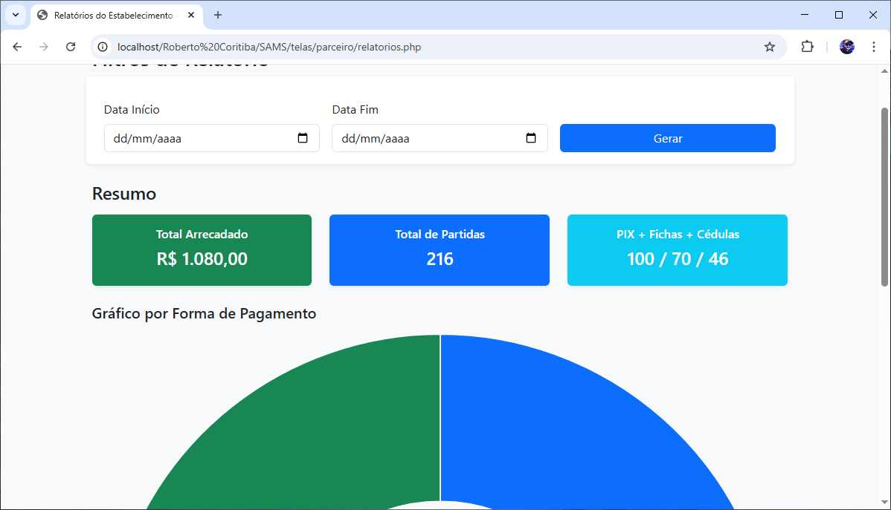
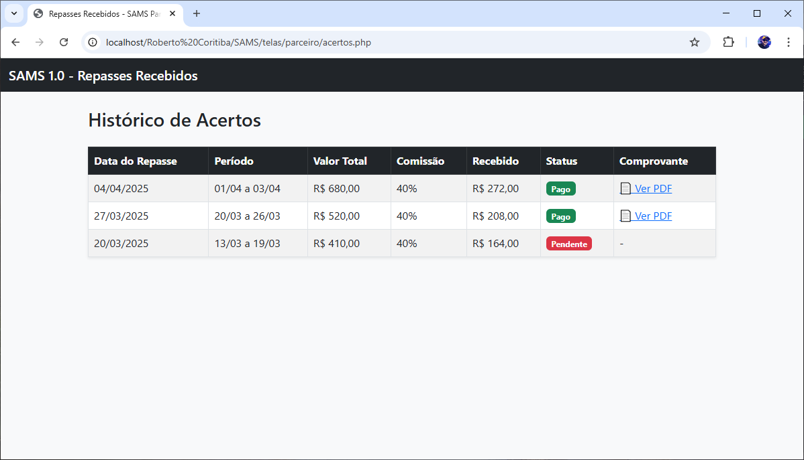
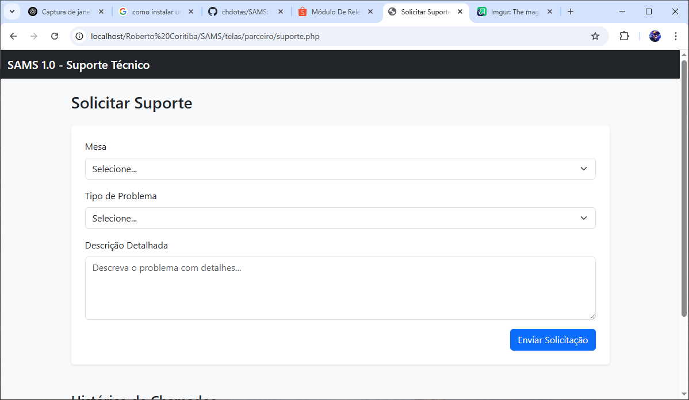

# SAMS 1.0 Beta  
### Sistema de Automação para Mesas de Sinuca

## Visão Geral

O **SAMS 1.0 (Sistema de Automação para Mesas de Sinuca)** é uma solução completa para controle, monitoramento e gestão de mesas de sinuca em estabelecimentos comerciais. O sistema utiliza um dispositivo embarcado baseado em **ESP32**, que permite o gerenciamento automatizado da liberação da mesa por meio de créditos inseridos via **moedeiro, noteiro ou pagamento via PIX**.

Com conectividade via **Wi-Fi** e suporte a **módulo de comunicação móvel 4G LTE** como alternativa, o dispositivo mantém comunicação constante com um **servidor central** para registro de dados, envio de comandos remotos e sincronização de informações. Alimentado por **bateria recarregável**, o SAMS é projetado com foco em **baixo consumo de energia** para garantir longa autonomia.

O sistema é complementado por um **painel administrativo web**, dividido em dois níveis de acesso:

- **Administração da empresa** (gestão de todas as mesas e estabelecimentos)
- **Gerenciamento de estabelecimentos parceiros** (controle individual de cada local)

Essa estrutura garante controle total, relatórios financeiros completos, geolocalização das mesas, integração com pagamentos e a automação inteligente da operação das mesas de sinuca.

---

# Manual de Uso – SAMS 1.0
## Sistema de Automação para Mesas de Sinuca

Seja bem-vindo!  
Este sistema foi desenvolvido para facilitar o uso das mesas de sinuca, oferecendo praticidade, segurança e controle total para o estabelecimento e o cliente.

---

## 📋 O que o sistema faz?

- Permite que o cliente **libere a mesa automaticamente** após o pagamento.
- Aceita **fichas, cédulas** ou **PIX**.
- Mostra no visor quantos créditos foram inseridos.
- Libera a gaveta com as bolas após o pagamento.
- Envia as informações para o sistema da empresa para controle e relatórios.
- Funciona mesmo em locais sem Wi-Fi, pois também pode usar chip de celular (internet móvel).
- Funciona com **bateria**, mesmo sem energia por um bom tempo.

---

## 💳 Como pagar para usar a mesa?

### Opção 1 – Pagamento com Ficha:
1. Insira a ficha no moedeiro.
2. O visor mostrará quantos créditos você tem.
3. Quando atingir o valor necessário, a gaveta será liberada automaticamente.

### Opção 2 – Pagamento com Dinheiro:
1. Insira a cédula no noteiro (aparelho que puxa o dinheiro).
2. O visor será atualizado com o saldo.
3. Ao atingir o valor, a mesa será liberada.

### Opção 3 – Pagamento por PIX:
1. Toque no botão ou opção “Pagar com PIX”.
2. O visor mostrará um **QR Code**.
3. Escaneie com seu app do banco e realize o pagamento.
4. Após a confirmação (em poucos segundos), a mesa será liberada automaticamente.

---

## 🔐 Segurança e Controle

- O sistema é travado remotamente quando necessário.
- O dono do estabelecimento pode **ver relatórios, valores recebidos e fazer acertos** com a empresa responsável.
- Todo o funcionamento é registrado e pode ser auditado.

---

## ℹ️ Informações Adicionais

- O visor da mesa mostra:
  - Quantos créditos estão disponíveis
  - Se a mesa está bloqueada ou liberada
  - Mensagens com instruções

- Caso tenha algum problema:
  - Verifique se o visor está ligado
  - Confirme se há energia ou bateria
  - Fale com o responsável do local

---

## 🧠 Dicas

- O QR Code tem tempo de validade. Se expirar, gere um novo.
- O sistema desliga o visor e economiza bateria automaticamente. Basta inserir uma ficha ou tocar no botão para reativar.
- Fichas falsas ou dobradas podem não ser reconhecidas.

---

## ✅ Pronto para jogar?

Simplesmente pague com ficha, cédula ou PIX e aproveite sua partida.  
O sistema cuida do resto. Divirta-se!

---

## Funcionalidades Principais

### Dispositivo Embarcado (ESP32)

O módulo instalado em cada mesa de sinuca é responsável por realizar toda a automação local e comunicação com o servidor. As principais funcionalidades incluem:

- **Recebimento de Créditos**  
  Aceita pagamentos por meio de moedeiro (fichas), noteiro (cédulas) e PIX (via QR Code gerado pelo servidor).

- **Interface com o Usuário**  
  Exibe informações como saldo disponível, status da máquina, instruções e QR Code para pagamento, utilizando um display OLED ou TFT.

- **Liberação Automatizada da Mesa**  
  Ao atingir o valor mínimo em créditos, o sistema aciona automaticamente a trava ou gaveta de bolas, permitindo o uso da mesa.

- **Armazenamento Local Inteligente**  
  Guarda temporariamente dados essenciais, como:
  - Créditos inseridos
  - Contadores de uso
  - Últimos status de operação

- **Conectividade Redundante**  
  Comunicação constante com o servidor via Wi-Fi, com suporte a módulo 4G LTE opcional, garantindo operação mesmo em ambientes sem conectividade local.

- **Eficiência Energética**  
  Desenvolvido para operar com bateria recarregável, o sistema utiliza técnicas avançadas de economia de energia como o modo deep sleep, além do desligamento de periféricos em períodos de inatividade.

---

## Componentes Essenciais para o Projeto

### Simplicidade e Eficiência com Placa Integrada

Para garantir um sistema compacto, confiável e fácil de montar, a escolha por componentes integrados traz grandes vantagens. A utilização de uma placa ESP32 com relés embutidos reduz o número de conexões, economiza espaço e aumenta a robustez da instalação.

---

### 1. Módulo ESP32 com Relé Duplo Integrado (5V–60V)

**Motivo da escolha:**  
Essa placa reúne em um único módulo o microcontrolador ESP32 e dois relés de potência, otimizando o layout e eliminando a necessidade de montar relés externos.

**Benefícios:**
- ESP32-WROOM-32 integrado (Wi-Fi e Bluetooth)
- Dois relés de 250V AC / 10A integrados
- Alimentação flexível de 5V a 60V, ideal para aplicações com bateria
- Comunicação com servidores via Wi-Fi
- Permite controle direto de cargas como eletroímãs, solenóides e gavetas automáticas
- Reduz o número de componentes e pontos de falha

🔗 [Ver na Shopee](https://shopee.com.br/M%C3%B3dulo-De-Rel%C3%A9-Wi-Fi-De-Canal-Duplo-ESP32-WROOM-Placa-De-Desenvolvimento-Secund%C3%A1rio-DC5-60V-Fonte-De-Alimenta%C3%A7%C3%A3o-i.473262812.25891622684)

---

### 2. Display LCD Colorido SPI TFT de 2.4" com SD (ILI9341)

**Motivo da escolha:**  
Tela ideal para exibir créditos, mensagens de status e QR Codes para pagamentos via PIX.

**Benefícios:**
- Resolução de 240x320 pixels
- Comunicação via SPI (baixo uso de pinos)
- Suporte para imagens e gráficos (QR Code, ícones, texto)
- Compatível com a maioria das bibliotecas do ESP32

🔗 [Ver no Mercado Livre](https://produto.mercadolivre.com.br/MLB-3254322626-display-lcd-24-tft-spi-touch-ili9341-com-leitor-sd-arduino-_JM)

---

### 3. Placa PCB Fenolite Ilhada 6x8cm

**Motivo da escolha:**  
Usada para conectar o display e outros periféricos de forma fixa e segura, especialmente se houver expansão do sistema (buzzer, LEDs, sensor de gaveta, etc).

**Benefícios:**
- Estrutura resistente e organizada
- Suporte à soldagem de diversos componentes
- Alternativa segura a protoboards para uso final

🔗 [Ver no Mercado Livre](https://produto.mercadolivre.com.br/MLB-1832864841-placa-ilhada-fenolite-6x8cm-montagem-de-circuitos-eletrnicos-_JM)

---

### 4. Caixa Plástica para Circuito Eletrônico (100x74x39mm)

**Motivo da escolha:**  
Protege todo o sistema contra poeira, umidade e impactos. Ideal para ambientes comerciais ou públicos.

**Benefícios:**
- Material durável
- Dimensões ideais para a placa ESP32 com relé + display
- Visual limpo e fácil instalação em máquinas

🔗 [Ver no Mercado Livre](https://produto.mercadolivre.com.br/MLB-3803198282-caixa-plastica-para-projetos-eletronicos-100x74x39mm-kit-10-_JM)

---

### 5. Módulo de Comunicação Móvel 4G LTE (SIM7600)

**Motivo da escolha:**  
Esse módulo permite a comunicação com o servidor em locais onde o Wi-Fi não está disponível, funcionando como um canal alternativo de dados via rede móvel.

**Benefícios:**
- Compatível com o ESP32 via comunicação serial (UART)
- Suporte a redes 4G LTE, 3G e 2G (fallback automático)
- Slot para cartão SIM padrão (chip de operadora)
- Permite envio de dados via HTTP, MQTT e comandos AT
- Ideal para uso comercial em locais públicos e afastados

🔗 [Ver na Shopee](https://shopee.com.br/product/690112303/23107288650)

**Observação:**  
Este módulo é **opcional** e deve ser usado em conjunto com um chip com plano de dados ativo. Pode ser integrado por meio de comandos AT e alimentação externa, conforme as especificações do fabricante.

---

## Conclusão

A adoção da **placa ESP32 com relés integrados** torna o projeto mais compacto, robusto e fácil de replicar em escala. Com menos fios, menos soldas e menos módulos separados, o sistema ganha em confiabilidade e reduz significativamente o tempo de montagem.

Esse conjunto oferece um excelente equilíbrio entre desempenho, simplicidade e economia — ideal para aplicações comerciais que exigem estabilidade e manutenção mínima.

---

# 🖥️ Painel Administrativo Web (PHP + MySQL)

O sistema web é dividido em **dois níveis de acesso**, com permissões específicas para cada tipo de usuário:

- **Administrador** (empresa responsável pelas mesas)
- **Parceiro** (estabelecimento onde a mesa está instalada)

## 🔐 Tela de Login

Todos os usuários devem acessar o sistema por meio de autenticação. A tela de login permite que o usuário selecione o tipo de perfil (Admin ou Parceiro) e seja redirecionado ao painel correspondente após validação.

### Campos:

- **Usuário (e-mail):** campo de entrada padrão
- **Senha:** campo seguro
- **Tipo de acesso:** seleção entre `Administrador` ou `Parceiro`

### Ações:

- Ao efetuar o login, o sistema redireciona:
  - Admin → `/admin/dashboard.php`
  - Parceiro → `/parceiro/dashboard.php`

---

## 👤 Administração (Empresa)

O administrador tem acesso completo ao sistema e é responsável por cadastrar mesas, gerenciar parceiros, acompanhar os resultados e realizar acertos financeiros.

### Funcionalidades

- **Dashboard Geral**
  - Visão resumida do sistema
  - Total arrecadado por período
  - Número de partidas
  - Mesas online/offline e bloqueadas
  - Alertas de bateria baixa ou falha de comunicação

- **Gestão de Mesas**
  - Cadastro de novas mesas com configurações iniciais
  - Edição e exclusão de mesas
  - Associação de cada mesa a um parceiro
  - Acompanhamento individual (detalhes, créditos, contador)
  - Logs de uso (data/hora, valor inserido, tipo de pagamento)

- **Cadastro e Gerenciamento de Estabelecimentos**
  - Nome, responsável, endereço e contato
  - Comissão por uso (% ou valor fixo)
  - Localização via mapa (Google Maps)

- **Geolocalização das Mesas**
  - Mapa interativo com todas as mesas
  - Filtros por status (online, offline, bloqueada)
  - Visualização rápida do estado geral da rede

- **Relatórios e Estatísticas**
  - Filtros por data, parceiro, forma de pagamento, mesa
  - Arrecadação detalhada com exportação em PDF ou Excel
  - Gráficos por dia, semana e mês

- **Gestão de Acertos**
  - Cálculo automático de comissão do parceiro
  - Histórico de pagamentos
  - Marcação de status (pago/pendente)
  - Upload de comprovante (PDF)

- **Configurações**
  - Formulários individuais de configuração por mesa
  - Parâmetros: valor por crédito, tempo de uso, volume, sensibilidade, modo economia
  - Definição de padrões para novas mesas
  - Controle de usuários internos (funcionários)

- **Central de Suporte**
  - Visualização de todos os chamados abertos por parceiros
  - Resposta via formulário interno
  - Marcação de status (em análise, resolvido)
  - Histórico completo de atendimento

### Telas utilizadas

- `/admin/dashboard.php`
- `/admin/mesas.php`
- `/admin/mesa_detalhe.php`
- `/admin/mesa_nova.php`
- `/admin/configuracoes.php`
- `/admin/estabelecimentos.php`
- `/admin/estab_detalhe.php`
- `/admin/mapa.php`
- `/admin/relatorios.php`
- `/admin/acertos.php`
- `/admin/suporte.php`

---

## 🧾 Estabelecimento (Parceiro)

O parceiro possui acesso restrito para acompanhar o desempenho e o uso das mesas instaladas no seu local.

### Funcionalidades

- **Dashboard do Estabelecimento**
  - Total arrecadado no mês
  - Quantidade de ativações (partidas)
  - Créditos por tipo de pagamento
  - Status das mesas (bateria, online, bloqueada)

- **Minhas Mesas**
  - Lista de mesas ativas
  - Créditos atuais e contador
  - Status em tempo real
  - Últimas interações

- **Relatórios**
  - Filtros por período e forma de pagamento
  - Resumo com gráficos simples
  - Visão clara de desempenho

- **Repasses e Acertos**
  - Histórico de valores recebidos
  - Situação do pagamento
  - Comprovantes (PDF)

- **Solicitação de Suporte**
  - Formulário para envio de chamado técnico
  - Histórico de chamados abertos e resolvidos

### Telas utilizadas

- `/parceiro/dashboard.php`
- `/parceiro/minhas_mesas.php`
- `/parceiro/relatorios.php`
- `/parceiro/acertos.php`
- `/parceiro/suporte.php`
- `/parceiro/perfil.php`

---

## 💡 Recursos Técnicos

- **Linguagem Backend:** PHP 8+
- **Banco de Dados:** MySQL / MariaDB
- **Frontend:** HTML5, CSS3, JavaScript (Bootstrap)
- **API REST:** Comunicação com dispositivos ESP32
- **Autenticação:** Login com permissões (admin/parceiro)
- **Geolocalização:** Google Maps API
- **Segurança:** Login seguro com controle de sessão (JWT opcional)

---

Caso queira, posso agora gerar a estrutura de banco de dados (`SQL`) ou iniciar os scripts PHP com autenticação e rotas básicas.

---

# Telas do Sistema

## Painel do Parceiro

### `telas/parceiro/dashboard.php`

### `telas/parceiro/minhas_mesas.php`

### `telas/parceiro/relatorios.php`

### `telas/parceiro/acertos.php`

### `telas/parceiro/suporte.php`

### `telas/parceiro/perfil.php`

---

## Painel do Administrador

### `/admin/dashboard.php`

### `/admin/mesas.php`

### `/admin/mesa_detalhe.php`

### `/admin/mesa_nova.php`

### `/admin/configuracoes.php`

### `/admin/estabelecimentos.php`

### `/admin/estab_detalhe.php`

### `/admin/mapa.php`

### `/admin/relatorios.php`

### `/admin/acertos.php`

### `/admin/suporte.php`

---

## 📄 Condições Contratuais e Execução

Este documento representa a proposta técnica e funcional do sistema **SAMS 1.0**, com todas as etapas, funcionalidades e tecnologias previstas.  

Atualmente, o projeto se encontra na **fase de ajustes e definição final** com o contratante. Durante esta etapa, o contratante pode propor **modificações e aprimoramentos** sobre o escopo inicial aqui descrito.

### Início da Execução

Após a **validação final do escopo e dos ajustes solicitados pelo contratante**, será firmado um **contrato de prestação de serviços** para o desenvolvimento completo da solução.

O início da execução ocorrerá imediatamente após:

- Acordo final sobre o escopo e prazos
- Assinatura do contrato de prestação de serviço
- Pagamento do sinal de calção

### Condições Comerciais

- 💰 **Valor total do projeto:** R$ 5.000,00 (cinco mil reais)
- 🔐 **Sinal de calção obrigatório:** 30% (R$ 1.500,00), pago no ato da assinatura do contrato
- ⏳ **Prazo para conclusão e entrega:** até **3 meses corridos** após o início formal

### Direitos do Contratante

O contratante terá total e irrevogável **direito sobre o código-fonte** e demais arquivos do projeto, incluindo:

- Código do firmware (ESP32)
- Código do painel administrativo (web)
- Banco de dados e estrutura das APIs
- Interface e arquivos gráficos desenvolvidos

O contratante poderá utilizar, modificar, redistribuir ou evoluir o sistema livremente após a entrega, **sem qualquer limitação técnica ou jurídica**.

---

Este projeto será executado com base nas etapas descritas nesta proposta, seguindo um cronograma claro, com transparência total e compromisso com a qualidade e entrega dentro do prazo acordado.

## ✅ Etapas do Projeto (Checklist)

Abaixo estão as fases previstas para o desenvolvimento completo do sistema SAMS 1.0 – com checklist para controle de progresso:

- [ ] **1. Definição da Arquitetura Geral**  
  - Planejamento do fluxo do sistema  
  - Separação dos módulos (hardware, software, API, painel)  
  - Definição de responsabilidades entre ESP32, servidor e banco de dados  

- [ ] **2. Escolha e Testes dos Componentes Eletrônicos**  
  - Seleção dos melhores componentes  
  - Testes de comunicação entre ESP32, periféricos e sensores  
  - Avaliação de consumo com bateria  

- [ ] **3. Desenvolvimento do Firmware ESP32**  
  - Leitura de entradas (fichas, cédulas, sensores)  
  - Controle de relés e display  
  - Comunicação com servidor via Wi-Fi / 4G  
  - Economia de energia (deep sleep)  

- [ ] **4. Criação da API e Banco de Dados**  
  - Endpoints RESTful em PHP  
  - MySQL com tabelas para mesas, créditos, transações  
  - Segurança básica (token, autenticação)  

- [ ] **5. Integração com Sistema de Pagamento PIX**  
  - Geração de QR Code (Gerencianet)  
  - Verificação automática de pagamento  
  - Liberação de crédito após confirmação  

- [ ] **6. Desenvolvimento do Painel Web (Admin e Parceiro)**  
  - Telas separadas por tipo de usuário  
  - Relatórios, suporte, controle de mesas  
  - Login seguro com permissões  

- [ ] **7. Implementação da Geolocalização e Mapas**  
  - Google Maps com marcadores por status  
  - Filtro por cidade e região  

- [ ] **8. Integração Completa e Testes Reais**  
  - Testes físicos com ESP32 + servidor  
  - Simulações de pagamento, bloqueio e liberação  
  - Operação offline com fallback  

- [ ] **9. Validação dos Relatórios e Acertos Financeiros**  
  - Teste de exportação PDF / Excel  
  - Cálculo de comissão e repasses  
  - Upload de comprovantes  

- [ ] **10. Documentação Final e Implantação**  
  - Manual técnico e instruções de instalação  
  - Entrega para estabelecimentos parceiros  
  - Monitoramento pós-implantação  

---

## 🗓️ Cronograma de Execução – 3 Meses

---

### 📅 Mês 1: Planejamento e Base Técnica

- [ ] **Semana 1**
  - [ ] Definição da arquitetura geral do projeto
  - [ ] Estruturação do repositório (painel, firmware, docs)
  - [ ] Escolha dos componentes (ESP32, relé, display, sensores)

- [ ] **Semana 2**
  - [ ] Testes com hardware (alimentação, relés, entradas)
  - [ ] Montagem da primeira versão do protótipo físico
  - [ ] Início do firmware com leitura de moedeiro/noteiro

- [ ] **Semana 3**
  - [ ] Exibição no display (créditos, status, mensagens)
  - [ ] Criação do banco de dados MySQL (estrutura básica)
  - [ ] Desenvolvimento inicial da API (PHP REST)

- [ ] **Semana 4**
  - [ ] Comunicação entre ESP32 ↔️ API
  - [ ] Teste de inserção de crédito e controle de liberação
  - [ ] Interface de login e acesso básico (painel web)

---

### 📅 Mês 2: Integração PIX + Painéis Web

- [ ] **Semana 5**
  - [ ] Integração com Gerencianet (geração de QR Code)
  - [ ] Processamento automático do pagamento PIX
  - [ ] Liberação de crédito após confirmação

- [ ] **Semana 6**
  - [ ] Criação do painel **Admin**
    - Dashboard, mesas, estabelecimentos
    - Cadastro de novas mesas com configurações iniciais
  - [ ] Exibição do status das mesas em tempo real

- [ ] **Semana 7**
  - [ ] Criação do painel **Parceiro**
    - Minhas mesas, repasses, relatórios e suporte
  - [ ] Relatórios simples por período e forma de pagamento

- [ ] **Semana 8**
  - [ ] Implementação da geolocalização via Google Maps
  - [ ] Mapa com status visual (online/offline/bloqueada)
  - [ ] Simulação completa do fluxo (crédito, uso, liberação)

---

### 📅 Mês 3: Acertos, Ajustes e Implantação

- [ ] **Semana 9**
  - [ ] Módulo de acertos financeiros (admin e parceiro)
  - [ ] Regras de comissão e histórico de repasses
  - [ ] Geração de comprovantes (PDF)

- [ ] **Semana 10**
  - [ ] Validação de relatórios e exportação (Excel, PDF)
  - [ ] Finalização da tela de suporte (chamados)
  - [ ] Testes de desempenho do painel e dispositivos

- [ ] **Semana 11**
  - [ ] Ajustes finos no firmware e na API
  - [ ] Teste com fallback 4G (SIM7600)
  - [ ] Testes em campo com estabelecimentos reais

- [ ] **Semana 12**
  - [ ] Documentação final (manual técnico e instalação)
  - [ ] Implantação inicial
  - [ ] Monitoramento e feedback dos primeiros parceiros

---

## Contato
Para dúvidas ou sugestões, entre em contato com o desenvolvedor do sistema.
